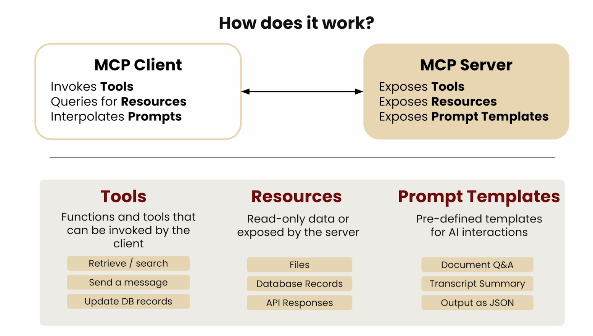
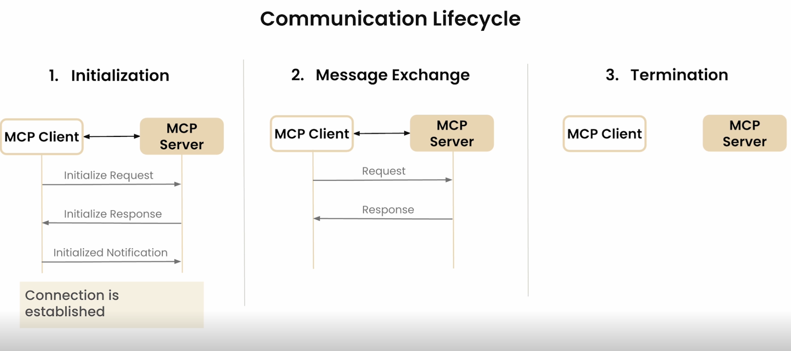

# Model Context Protocol (MCP) Notes

## Overview

- MCP is a protocol for connecting AI models to external tools and data sources
- Uses a client-server architecture with JSON-RPC over stdio or HTTP/SSE

## Key Concepts

### Architecture

- **Host**: The AI application (e.g., Claude Desktop, IDE)
- **Client**: Maintains a 1:1 connection with a server
- **Server**: Exposes tools, resources, and prompts to the client

### Transport Layers

- **stdio**: Communication over standard input/output (local processes)
- **SSE (Server-Sent Events)**: HTTP-based transport for remote servers
- **Streamable HTTP**: ....
   
### Primitives

| Primitive | Description | Example |
|-----------|-------------|---------|
| Tools | Functions the model can call | `get_weather()`, `query_db()` |
| Resources | Data the model can read | Files, database schemas |
| Prompts | Reusable prompt templates | Summarization, code review |

## Server Development

### FastMCP (Python)

```python
from mcp.server.fastmcp import FastMCP

mcp = FastMCP("server-name")

@mcp.tool()
async def my_tool(param: str) -> str:
    """Tool description."""
    return result

if __name__ == "__main__":
    mcp.run(transport="stdio")
```

### Key Points

- Tools must have docstrings (used as descriptions for the model)
- Use type hints for parameters (becomes the input schema)
- `mcp.run(transport="stdio")` starts the server

## Client Development

### Connection Flow

1. Create `StdioServerParameters` with command and args
2. Open `stdio_client` transport
3. Create `ClientSession`
4. Call `session.initialize()`
5. Use `session.list_tools()` and `session.call_tool()`

```python
from mcp import ClientSession, StdioServerParameters
from mcp.client.stdio import stdio_client

server_params = StdioServerParameters(
    command="uv",
    args=["--directory", str(path.parent), "run", path.name],
)
```

## Troubleshooting

| Error | Cause | Fix |
|-------|-------|-----|
| `Connection closed` | Server exits without starting | Ensure `mcp.run()` is called |
| `NameError: mcp not defined` | Missing import | Import `mcp` from the module that defines it |
| Coroutine expected | Non-async `main` passed to `asyncio.run()` | Use `async def main()` at module level |

## Resources & Links

- [MCP Specification](https://spec.modelcontextprotocol.io)
- [Python SDK](https://github.com/modelcontextprotocol/python-sdk)
- [TypeScript SDK](https://github.com/modelcontextprotocol/typescript-sdk)

## Course 1 Notes - MCP: Build Rich-Context AI Apps with Anthropic (https://www.deeplearning.ai/courses/mcp-build-rich-context-ai-apps-with-anthropic)

Who authors the MCP server?
How is using an MCP server different from just calling a service's api directly?
Sounds like MCP servers and tool use are the same thing.?




